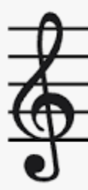

# Zhiyuan Zhang's User Page

# My Information
Hello, this is Zhiyuan Zhang, and I prefer the name ***Ivan***, which is why my github account is called fatIvan. I am a third-year computer science student.
I have been a math major for the first two years of college and I got into computer science major half a year ago. 

I really enjoy learning programming languages on my own, especially finding some shortcuts. For instance, I recently found out that I can do `git switch <branch name>` to quickly create an checkout a new branch at once which is indeed fascinating.
Since I am relatively new to this major, I could program in only a few languages listed below from most comfortable to the least.

1. Java
2. C++
3. HTML

This quarter, I plan to learn CSS, JavaScript, React, and some advanced Java coding techniques. During spring break, I had spent some time on CSS and JavaScript, and I think I can handle some basic problems now. Hopefully I can master all these programming languages by the end of this spring quarter.
- [x] CSS
- [x] JavaScript
- [ ] Advanced Java
- [ ] React

# My hobbies
Besides programming, I really enjoy playing the piano，swimming in my free time, and playing with dogs. Here is my [favorite breed](pug.jpg). I really enjoy listening to classical music as well as all sorts of songs. Since high school, I have been recording myself playing some piece and you can find it in my
[Channel](https://space.bilibili.com/35830558?from=search&seid=13932100923906934675).

So far, my favoriate pianests have been 

- Maksim Mrvica
- Animenz
- Lang Lang

And my favorite quote is 
>Music is a higher revelation than philosophy.

from Beethoven.

[Back to top](#my-information)

[Link back to README](README.md)
